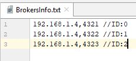
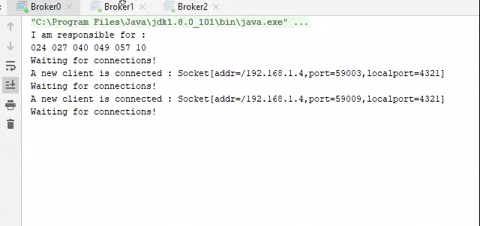
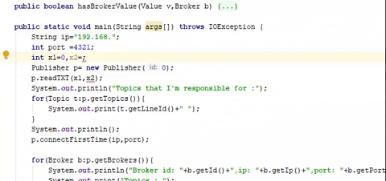
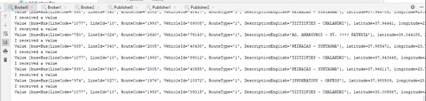
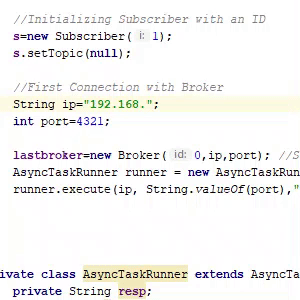

# LiveBusMaps
This Project is based on Publish/Subscribe system and was created in terms of course Distributed Systems in the 6th semester of Departement of Computer Science @ AUEB. 

### Publish/Subscribe System
is a messaging pattern where senders of messages, called _publishers_, do not program the messages to be sent directly to specific receivers, called _subscribers_, but instead categorize published messages into classes without knowledge of which subscribers. In fact, in this system, publishers connect with _brokers_ which forward the message to the subscriber that want to take the message. Subscribers express interest in one or more classes and only receive messages that are of interest, without knowledge of which publishers, if any, there are.
In this project, We want to gather the real-time bus location information. We don't have real-time data ,so publishers have to read a txt file named "busLinesNew" which is located in DS_project_dataset folder and has location data from the greek buses.
Brokers distribute the topics(bus lines) according to their hashed number.
Also,an Android application has been made for Subscribers.

##### Note that it works only in private network,ips and ports.
###### source:  [Wikipedia:Publish/Subscribe System](https://en.wikipedia.org/wiki/Publish%E2%80%93subscribe_pattern)

#### Initializing Publishers and Brokers
In order to initialize publishers and brokers ,you need to know how many of them you want. In this example, we use 3 publishers and 3 brokers. Also ,you should know the ips and the ports that you want to bond publishers and brokers.  
IPs and Ports for Brokers should be written in BrokersInfo.txt in this way.

So, When you start a Broker ,you should give program arguments that seems like :[ip] [port] [id] ex.192.168.1.4 4321 0
As long as you start the brokers , you should see something like this:

To start a publisher you need to initializing in this way:

After running the publishers ,you should see that brokers receive the information.

#### Running Subscribers
After completing the procedure with brokers and publishers , it's time for subscribers.
First , you should type the port ,ip of the Broker you want to connect first and the ID of Subcriber.

After installing apk to your android smartphone, you can interact with the app.

.gif)

.gif)
